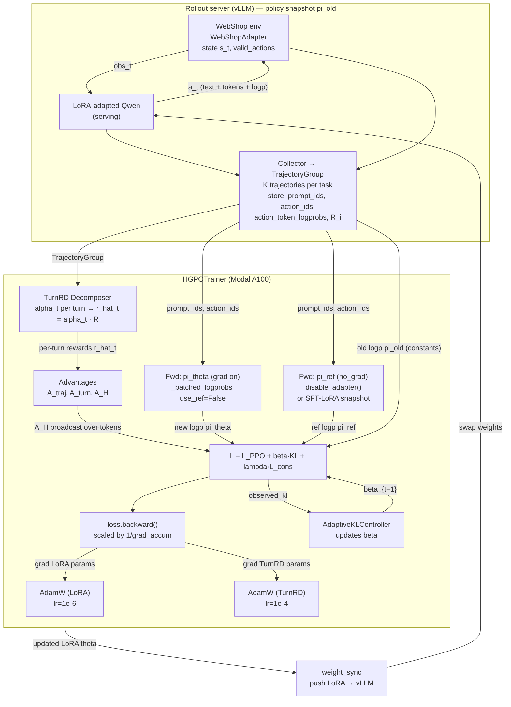
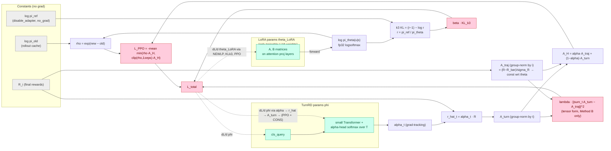
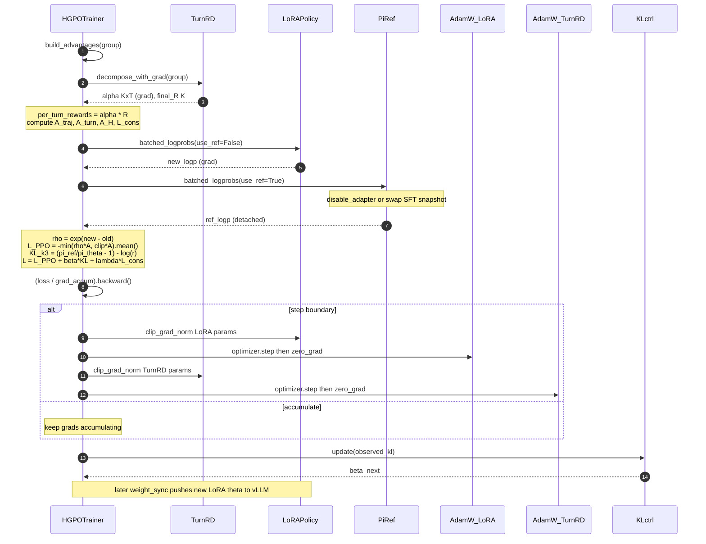

# H-GRPO Training Loop & Gradient Flow (TurnRD as decomposer)

Visual reference for the H-GRPO PPO-style trainer in
`src/algorithms/grpo/trainer.py` with the **Method B** TurnRD decomposer
(`src/algorithms/hgpo/decomposers/turnrd.py`) wired in.

---

## 1. Top-level training loop (rollout ↔ trainer ↔ vLLM)

---

## 2. Gradient flow — where ∂L/∂θ goes

---

## 3. One `train_step(group)` — operation sequence

---

## Key things the diagrams encode

- **Two distinct forwards through the same Qwen body each step** — one with the LoRA active (grad on, gives `new_logp` → drives PPO + KL gradient into θ_LoRA), one with LoRA disabled (no_grad, gives `ref_logp` → constants for the KL term). Code: `_batched_logprobs` in `src/algorithms/grpo/trainer.py:312`.
- **Two separate optimizers** — `AdamW(θ_LoRA, lr=1e-6)` for the LLM and `AdamW(φ_TurnRD, lr=1e-4)` for the decomposer (`trainer.py:223-252`). They share `loss.backward()` but step independently.
- **Gradient enters TurnRD only via Method B** — the tensor-form `consistency_loss_tensor` plus the grad-tracking `α_t` flowing into `Â_turn` → `Â_H` → PPO loss. For Methods A/C, TurnRD doesn't exist and the decomposer is a pure-Python callable with zero grad.
- **`R_i` is a constant** w.r.t. both θ and φ (came from the env), but `α_t · R` makes the attribution of R across turns learnable.
- **PPO ratio uses `new − old`**, while **KL k3 uses `ref − new`** (reversed) — see `trainer.py:493-498`, ensuring an unbiased non-negative KL(π‖π_ref).
