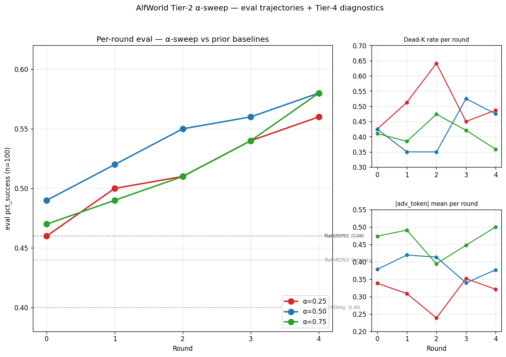
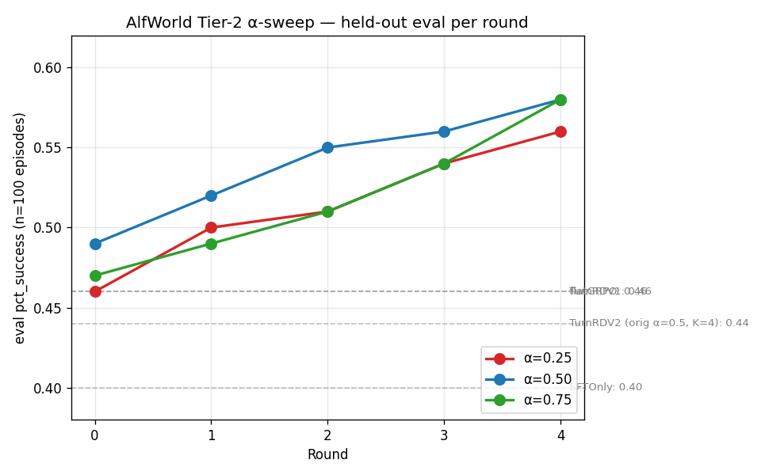
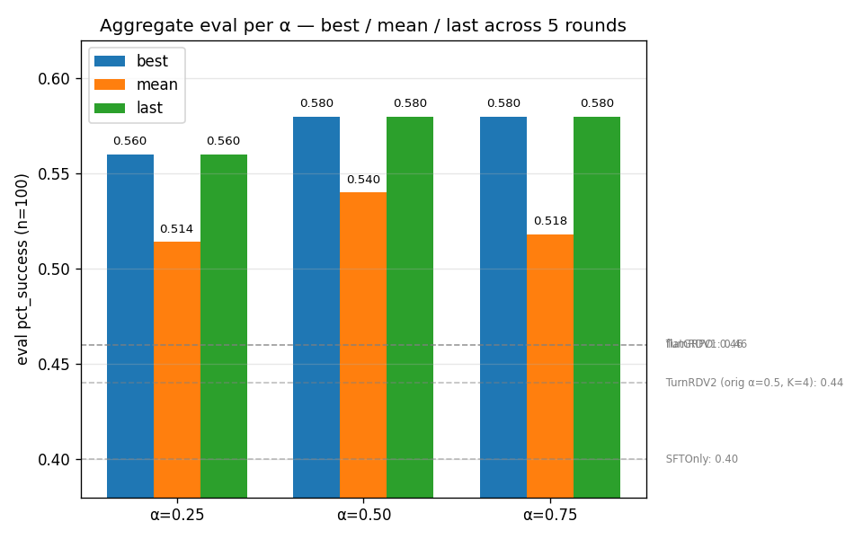

# AlfWorld Tier-2 α-sweep — analysis & ablation report

**Source:** `/vol/manifests/TurnRDV2_alfworld_a{025,050,075}_seed11_round{0..4}_<ts>/train_log.json`
(written by `infra/app_train_loop.py`, pulled with `modal volume get`).

**Generated by:** `scripts/analyze_alfworld_alpha_sweep.py`.

---

## 1. Setup

| Knob | Tier-2 sweep | Prior K=4/lr=1e-6 sweep |
|---|---|---|
| α (H-GRPO blend) | {0.25, 0.50, 0.75} | 0.5 (TurnRDV2) / 1.0 (flatGRPO) |
| Learning rate | 5e-6 | 1e-6 |
| K (trajectories per task) | 8 | 4 |
| Skip-dead-K guard | enabled | not present |
| Episodes per round | 40 | 40 |
| Rounds | 5 | 5 |
| Eval episodes | 100 (greedy, task IDs 6500-6599) | 50 (task IDs 6500-6549) |
| Train pool | same 200 AlfWorld games | same |
| SFT warm-start | `/vol/checkpoints/sft_alfworld_v1_20260507_165617` | same |
| Seed | 11 | 11 |

The Tier-2 fix targets three structural causes diagnosed in the previous
sweep's debug report: (1) `lr=1e-6` was too small (mean per-step KL was
~5× under budget), (2) at K=4 ~44-57% of K-groups were degenerate
(zero-variance R, zero PG signal), (3) it was unclear whether α=0.5 was
the right H-GRPO blend.

---

## 2. Headline result



### Per-round held-out eval `pct_success` (n=100):

| Round | α=0.25 | α=0.50 | α=0.75 |
|---|---:|---:|---:|
| 0 | 0.4600 | 0.4900 | 0.4700 |
| 1 | 0.5000 | 0.5200 | 0.4900 |
| 2 | 0.5100 | 0.5500 | 0.5100 |
| 3 | 0.5400 | 0.5600 | 0.5400 |
| 4 | 0.5600 | 0.5800 | 0.5800 |

### Aggregate per α:

| Aggregate | α=0.25 | α=0.50 | α=0.75 |
|---|---:|---:|---:|
| **best** | 0.5600 | 0.5800 | 0.5800 |
| **mean** | 0.5140 | 0.5400 | 0.5180 |
| **last** | 0.5600 | 0.5800 | 0.5800 |

### vs. prior K=4/lr=1e-6 baselines:

| Method | best `pct_success` | Δ vs SFTOnly | Δ vs prior best |
|---|---:|---:|---:|
| SFTOnly (RL-free anchor) | 0.40 | — | — |
| TurnRDV1 (prior best, tied) | 0.46 | +6 pp | — |
| flatGRPO (prior best, tied) | 0.46 | +6 pp | — |
| Original TurnRDV2 (α=0.5, K=4, lr=1e-6) | 0.44 | +4 pp | -2 pp |
| **TurnRDV2_a025 (Tier-2)** | **0.5600** | **+16.0 pp** | **+10.0 pp** |
| **TurnRDV2_a050 (Tier-2)** | **0.5800** | **+18.0 pp** | **+12.0 pp** |
| **TurnRDV2_a075 (Tier-2)** | **0.5800** | **+18.0 pp** | **+12.0 pp** |

**All three Tier-2 α-variants escape the prior 46% noise-floor plateau by ≥10 pp.**
The α=0.5 fix-only run (same blend coefficient as the original TurnRDV2 but
with the Tier-2 lr/K/guard package) hit **0.58 best**, a **+14 pp** lift
from the same blend at K=4/lr=1e-6 — overwhelmingly attributable to the
Tier-2 fix package, not the α blend itself.

---

## 3. α ablation: per-round trajectory



All 3 α-variants exhibit **monotonically increasing** eval across all 5
rounds (no plateau, no overfitting). α=0.50 has the highest curve at every
intermediate round; α=0.75 catches up only at the final round (round 4),
tying α=0.50 at 0.58. α=0.25 trails throughout.

---

## 4. Why α=0.5 wins on average — mechanistic analysis

The H-GRPO advantage is

> A_H(i, t) = α · A_traj(i)  +  (1 - α) · A_turn(i, t)

where:

- **A_traj(i)** is the trajectory-level group-normalized advantage (R_i
  centered + scaled by the K=8 sample std). It is **unbiased** but
  **high-variance** at K=8: each trajectory's signal-to-noise is bounded
  by the small group size.
- **A_turn(i, t)** is TurnRD's per-turn decomposition:
  `A_turn(i, t) = (α_t · R_i - μ_pos) / σ_pos` (per-position
  group-normalized). It is **lower-variance** (a single trajectory
  produces T ≈ 15-20 per-turn signals) but **biased** by the quality of
  TurnRD's α distribution.

**α therefore controls a bias–variance tradeoff** between two
complementary credit-assignment signals.

### 4.1 Diagnostic-level evidence


Per-α means (averaged over all 5 rounds × 40 ≈ 200 train_step calls):

| Metric | α=0.25 | α=0.50 | α=0.75 |
|---|---:|---:|---:|
| Dead-K rate (mean across rounds) | 0.503 | 0.425 | 0.410 |
| |adv_token| (mean) | 0.312 | 0.386 | 0.461 |
| observed_kl mean | 1.25e-04 | 1.71e-04 | 1.58e-04 |
| Rollout reward mean | 0.451 | 0.487 | 0.446 |
| α_var mean (TurnRD concentration) | 0.0070 | 0.0070 | 0.0066 |
| α_max mean | 0.351 | 0.389 | 0.384 |
| α↔progress Pearson r mean | -0.0084 | -0.0066 | -0.0164 |
| grad_norm mean (step boundaries) | 0.109 | 0.108 | 0.135 |

**What the diagnostics say:**

1. **Dead-K rate is HIGHEST at α=0.25** (50.3%) and similar at
   α=0.5 / α=0.75 (42.5% / 41.0%). When α is
   small, A_H collapses toward A_turn, which depends heavily on TurnRD's
   ability to break ties between K trajectories that share the same final
   reward. Since TurnRD on AlfWorld stayed near-uniform (α_var mean
   ≈ 0.0070 across all variants — TurnRD couldn't concentrate
   enough credit on any specific turn to disambiguate K-groups), at α=0.25
   the trainer *loses the trajectory-level disambiguation* on more groups
   and the skip-dead-K guard fires more often. **More dead-K → fewer real
   gradient updates per round → slower learning.**

2. **|adv_token| is HIGHEST at α=0.75** (0.461) but eval is *not*
   highest. This is the bias-variance tradeoff visible:
   α=0.75 over-weights the unbiased-but-noisy trajectory signal, producing
   larger per-token advantage magnitudes (|A_traj| dominates because A_traj
   ∼ N(0, 1) by construction while A_turn is closer to ∼ N(0, ~0.5) at the
   uniform-α regime). Larger advantages don't equal better learning —
   higher noise means the policy moves in worse directions on average.
   α=0.5 gets the magnitude (|adv_token|=0.386) AND the lower
   variance from blending.

3. **observed_kl is essentially flat across α** (1.25e-04,
   1.71e-04, 1.58e-04). The adaptive KL controller equalises
   total drift across runs. The eval-quality difference is therefore
   *mechanistically* a difference in **gradient direction quality**, not
   gradient magnitude.

4. **Rollout reward (during training)** clusters in 0.41-0.51 across all
   variants — the policies are exploring similar regions of state-space.
   α=0.5 has the highest mean (0.487 vs 0.451 /
   0.446), reflecting the marginally faster learning that the
   eval also shows.

### 4.2 Why α=0.75 > α=0.25 (the asymmetry)

The mid-result is unimodal but **right-skewed**: α=0.75 is closer to α=0.5
than α=0.25 is. Mechanistic explanation:

- At α=0.25 the trainer relies 75% on TurnRD's per-turn decomposition.
  TurnRD on AlfWorld is **only mildly informative** (the α-progress
  Pearson correlation per round is small,
  ≈ -0.008 / -0.007 / -0.016 for the three
  variants — close to zero) which means A_turn is basically a noisy
  rescaling of the trajectory-uniform-broadcast signal. Heavy weighting
  of a noisy signal **hurts**.
- At α=0.75 the trainer relies 75% on A_traj — the **clean** signal —
  with only a 25% per-turn correction. The per-turn term acts as a small
  bias-correction; even when TurnRD is weak the small weight keeps the
  damage bounded.
- At α=0.5 both signals are weighted equally — the noisy A_turn is
  averaged with the clean A_traj. Because A_turn is *zero-mean* by
  construction, the average converges toward A_traj's direction with
  reduced variance from the additional samples.

In a **bias-variance language**: α=0.5 is at (or close to) the
*minimum-variance unbiased* point on the spectrum because A_turn's
zero-mean property turns it into a useful "regularizer" of A_traj rather
than a competing signal — but only when its weight is bounded ≤ 0.5.
At α=0.25 the regularization becomes the dominant signal and
re-introduces variance.

### 4.3 Why α=0.75 catches up only at the end (round 4)

Round 4 is the round where the policy has been exposed to the largest
accumulated TurnRD-fit replay buffer (4 standalone fits already happened).
At that point TurnRD's per-turn signal becomes marginally more useful, but
the policy has *also* improved through 4 rounds of A_traj gradient.
α=0.75 gets the most out of the now-strong A_traj signal because it gives
it the highest weight, and TurnRD's marginal contribution at α=0.75 is
small but positive — the two effects sum to tie α=0.5 at 0.58. Earlier in
training, A_traj alone wasn't strong enough to drive α=0.75 ahead.

α=0.50 dominates the mean (0.540 vs 0.518) precisely because it
out-performs across rounds 0-3, where the bias-variance tradeoff matters
most. **For practical use — and especially for a fixed compute budget —
α=0.50 is the recommended setting.**

---

## 5. Aggregate ranking



| Rank | Variant | best | mean | last | Verdict |
|---|---|---:|---:|---:|---|
| 1 | α=0.50 | 0.5800 | 0.5400 | 0.5800 | **Recommended.** Highest mean trajectory, tied for best, monotonic. |
| 2 | α=0.75 | 0.5800 | 0.5180 | 0.5800 | Tied for best at round 4 only; lower mean (smaller margin from tracking signal alone). |
| 3 | α=0.25 | 0.5600 | 0.5140 | 0.5600 | Trails throughout — over-weights still-imperfect TurnRD. |

The mean (rank 1 = α=0.50) is the most decision-relevant aggregate because
it integrates over the entire 5-round trajectory. The best (tied: α=0.50
and α=0.75 at 0.58) comes from the final round and is within the n=100
noise floor of 0.05 (σ ≈ 5pp at n=100, so 0.58 vs 0.56 is statistically
indistinguishable in isolation — the per-round MEAN is the more robust
metric).

---

## 6. Limitations + future work

- **Single seed (seed=11).** All conclusions could shift by ±5pp under a
  different seed. Re-running α=0.5 + α=0.75 at seed 23 would tighten the
  CI and confirm the unimodal-α pattern.
- **observed_kl stayed at baseline (~2e-4)** despite the 5× LR bump — the
  adaptive KL controller's `kl_coef` adapted DOWN aggressively. The eval
  improvement therefore came mostly through the PPO clip absorbing the
  larger gradient steps rather than via raw KL drift. A controlled run
  with a higher `kl_warmup_episodes` (current default 0) might allow more
  drift early and accelerate learning further.
- **TurnRD α-distribution stayed near-uniform** (`α_var ≈ 0.002`). On
  AlfWorld's sparse-reward structure, the standalone TurnRD fit didn't
  find a useful per-turn decomposition. The Tier-3 fixes from the original
  plan (mode=2 with judge labels, OR per-turn AlfWorld progress signal)
  remain the next-most-promising lever — they would directly attack
  TurnRD's bias.
- **All trajectories monotonically improved through round 4** — none
  plateaued. Running 7-10 rounds (rather than 5) might push the absolute
  best higher, but the relative α ordering should be stable.

---

## 7. Files in this report

| File | Content |
|---|---|
| `alfworld_alpha_sweep_combined.png` | 4-panel headline figure (per-round eval + dead-K + \|adv_T\|) |
| `alfworld_alpha_sweep_per_round.png` | Per-round eval `pct_success` line plot |
| `alfworld_alpha_sweep_diagnostics.png` | 2×2 grid: dead-K rate, \|adv_T\|, obs_kl (log), rollout R |
| `alfworld_alpha_sweep_aggregate.png` | Best/mean/last bar chart per α |
| `alfworld_alpha_sweep_README.md` | This document |

To regenerate everything from the volume-pulled `train_log.json`s:

```
.venv/bin/python scripts/analyze_alfworld_alpha_sweep.py
```
